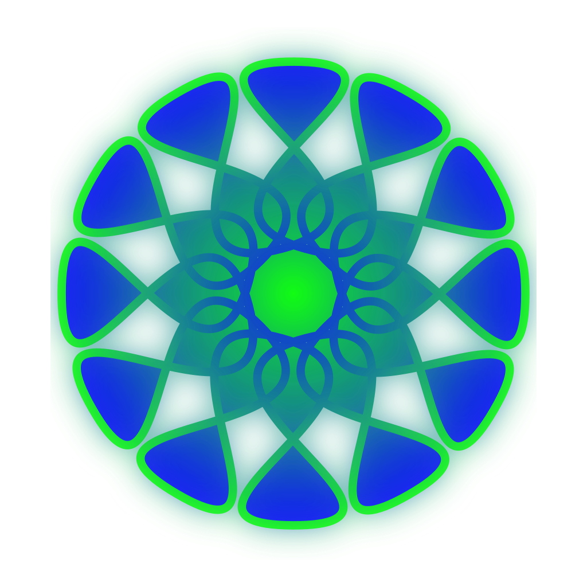

# MYS Material

hier findet ihr eine Liste aller MYS Materialien:

[ping](https://s-light.eu)

:tada:
:100:



<style>
    img {
        max-width: 200px;
    }
</style>


### test for code-highlight

```c++
unsigned long nextEvent = 0;
const unsigned long duration= 1000;
```

### test for include
<!-- @include ./examples/pixel_minimal/pixel_minimal.ino -->

```c++ :./example.cpp
// ./example.cpp
```

# Funktionen
